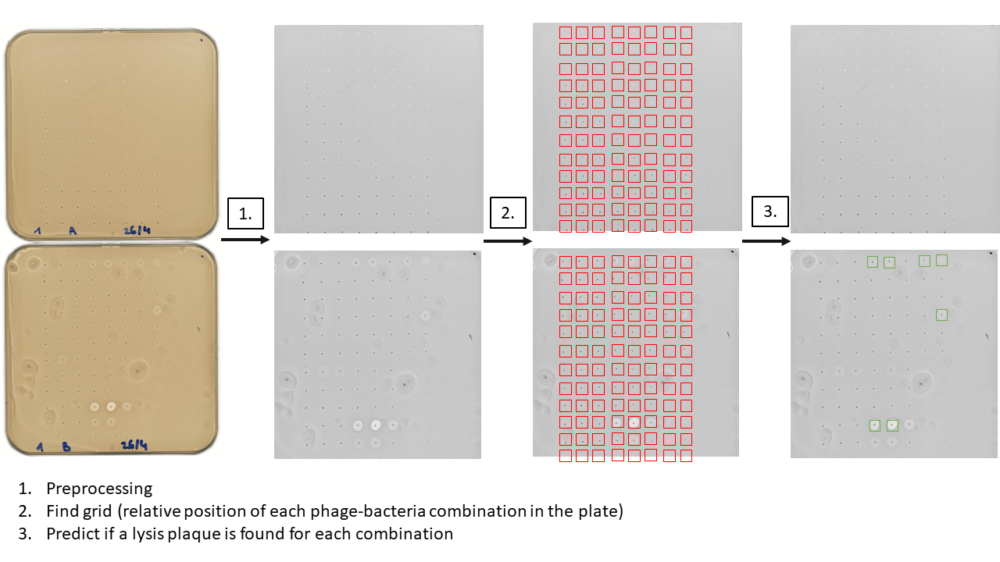

# Plaque_assay_analysis
Code for image analysis of the plaque assay experiments.

### Global scheme

The aim is to analyze the image to retrieve
- The identity of each combination (which is given by its position in the overall 12 $\times$ 8 grid)
- If a lysis happened (no, yes (case 1 and 2), or many lysis plaques (case 6)).

### 1. Preprocessing
**Aim :** to go from the original scanner image to an image per plate, centered on the grid.

### 2. Find the grid position
**Aim :** to retrieve the identity of each combination by finding its position in the 12 $\times$ 8 grid.

**Hypothesis :** grids are always of shape 12 $\times$ 8 and with $\Delta x = \Delta y = 105 pixels$. A method to relax this hypothesis is currently in development (to have a specific grid shape and $\Delta x$, $\Delta y$ per plate). 

### 3. Predict if a lysis plaque is present at each position
**Aim :** For each identified combination, analyze the phenotype and store it into the final results database.
